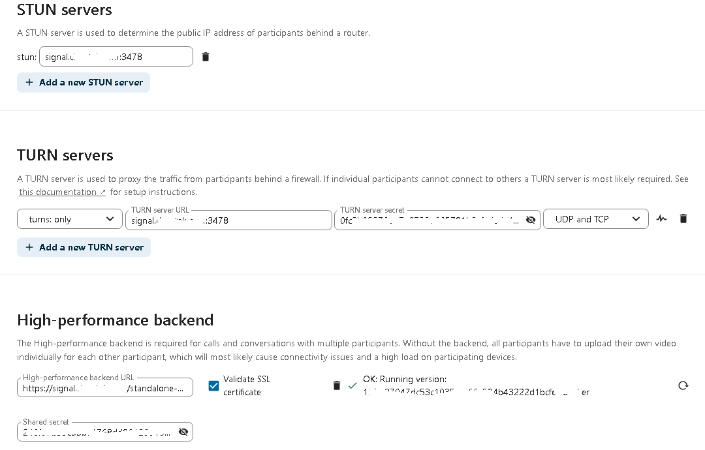

## About

Spreed standalone signaling server for Nextcloud.

For more information please visit [https://github.com/strukturag/nextcloud-spreed-signaling](https://github.com/strukturag/nextcloud-spreed-signaling).

Original Credit and Inspiration: [MARKUS WEINGÄRTNER](https://markus-blog.de/index.php/2020/11/20/how-to-run-nextcloud-talk-high-performance-backend-with-stun-turnserver-on-ubuntu-with-docker-compose/)

## General Requirements

Spreed standalone signaling server requires that you have a fully updated Ubuntu 18.04 (also tested successfully on Ubuntu 20.04) machine with Docker and Docker Compose as well as a fully functioning Nextcloud installation.


## Prerequisites

The installation script will prompt you for the following information. Ensure you have the following information available **BEFORE** running the script:

- **Nextcloud-Signal Hostname** This is the hostname you wish to use for Nextcloud-Signal **WITHOUT** the domain (Example: signal). This is used in combination with the Nextcloud-Signal Domain to form the URL of your Nextcloud-Signal instance.
- **Nextcloud-Signal Domain** This is the domain you wish to use for Nextcloud-Signal (Example: domain.tld). This is used in combination with the Nextcloud-Signal Hostname to form the URL of your Nextcloud-Signal instance (Example: Nextcloud-Signal.domain.tld).
- **Nextcloud Instance URL** This is the FQDN URL of a Nextcloud server instance that will be connecting to the Nextcloud-Signal server. You **MUST** include http:// or https:// (Example: https://cloud.domain.tld).

## Installation

Clone the deeztek-docker repository with git:

```
sudo git clone https://github.com/deeztek/deeztek-docker.git
```

This will clone the repository and create a docker directory in the directory you ran the git clone command from.

Change to the nextcloud-spreed-signaling directory:

```
cd deeztek-docker/Linux/nextcloud-spreed-signaling
```

Run the following script as root:

```
sudo bash ubuntu_install_nextcloud_signal.sh
```

The script will create a **/opt/nextcloud-spreed-signaling/** directory and configure all necessary directories and files under that directory. 

It will automatically generate the following random variables and insert those variables in the appropriate configuration files (server.conf, .env, default):

* Static Secret
* Hash Key
* Block Key
* Shared Secret
* Api Key

It will output the following variables which you will need in order to configure your Nextcloud instance, so ensure you take note of them:

* Static Secret
* Shared Secret

It will build and deploy the following six containers:

* nextcloud_spreed_nginx
* nextcloud_spreed_backend
* nextcloud_spreed_janus
* nextcloud_spreed_coturn
* nextcloud_spreed_nats
* nextcloud_spreed_certbot

## Let's Encrypt Certificates

The installation script automatically configures a scheduled cron job to renew Lets Encrypt Certificates on a daily basis.

By default, the script will launch Nginx reverse proxy with a self-signed certificate. If you wish to leverage a Lets Encrypt certificate, ensure that BOTH ports 80/TCP and 443/TCP are open to the Internet and the FQDN of your Nextcloud-Signal server which is derived from the **Nextcloud-Signal Hostname** and **Nextcloud-Signal Domain** you specified during the installation of the script point to the public IP of your Nextcloud-Signal instance. 

Before attempting to get a production Lets Encrypt certificate, you should test with the Lets Encrypt Staging environment first by running the following script:

```
sudo bash certbot_certificate_staging.sh
```

The script will ask you for an e-mail address and it will ask you to agree to the Lets Ecnrypt Terms of Service. If it all goes well, it will output the following indicating success:

```
...
The dry run was successful.
...
```

If succesful, you can now safely run the following script to get a production Lets Encrypt Certificate:

```
sudo bash certbot_certificate_production.sh
```

The script will ask you for an e-mail address, it will ask you to agree to the Lets Ecnrypt Terms of Service and ask you to agree to shared your e-mail address with the Electronic Frontier Foundation. If it all goes well, it will output the following indicating success:

```
....
Successfully received certificate.
....
```

## Connect Nextcloud to Nextcloud-Signal

Login to Nextcloud as an Administrator and add and enable the **Nextcloud Talk** app. 

Next navigate to **Settings --> Administration --> Talk**. 

In the **STUN servers** section, enter the FQDN of your Nextcloud-Signal instance on port 3478 (Example: signal.domain.tld:3478), in the **TURN severs** section, select **turn: and turns:** on the drop-down and enter enter the FQDN of your Nextcloud-Signal instance on port 3478 (Example: signal.domain.tld:3478) and enter the **Static Secret** variable that was output earlier in the **secret** field. 

In the High-performance backend section, click the + button and enter **https://signal.domain.tld/standalone/signaling/** where **signal.domain.tld** is tha actual FQDN of your Nextcloud-Signal instance and in the **Shared secret** field enter the **Shared Secret** variable that was output ealier (**Figure 1**):

**Figure 1**




